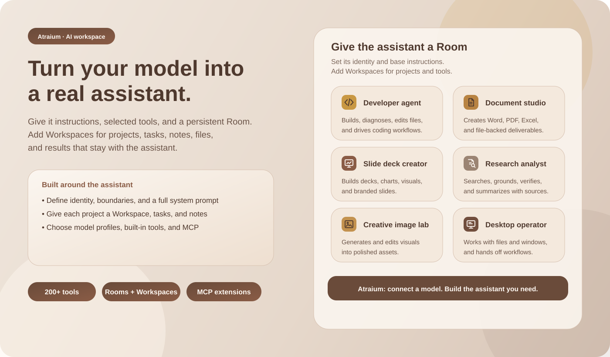
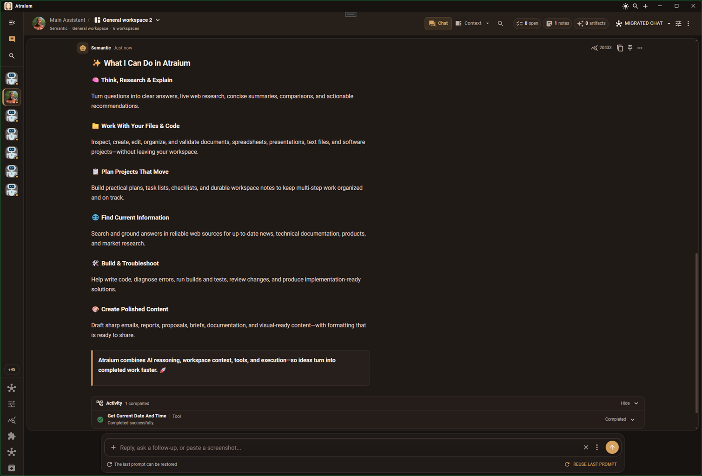

# Atraium Preview

> **Turn your model into an assistant. Give it a role, selected tools, persistent working spaces, and somewhere to keep the work.**

## Official website and downloads

[**atraium.com**](https://atraium.com) is the official Atraium website. Trusted preview downloads are published through this repository and its GitHub Releases page.

The current Windows and Android preview is **[Atraium 0.3.4 Preview 1](https://github.com/daemosofchaos/Atraium-Preview/releases/tag/v0.3.4-preview.1)**.

| Download | Purpose |
|---|---|
| [Windows x64 installer (.exe)](https://github.com/daemosofchaos/Atraium-Preview/releases/download/v0.3.4-preview.1/Atraium-0.3.4-preview.1-win-x64-setup.exe) | Install Atraium for the current Windows user. |
| [Portable Windows x64 archive (.zip)](https://github.com/daemosofchaos/Atraium-Preview/releases/download/v0.3.4-preview.1/Atraium-0.3.4-preview.1-win-x64-portable.zip) | Extract and run Atraium without an installer. |
| [Android APK](https://github.com/daemosofchaos/Atraium-Preview/releases/download/v0.3.4-preview.1/Atraium-0.3.4-preview.1-android.apk) | Sideload on Android 7.0+ devices with arm64-v8a or x86_64 support. |
| [Android preview bundle (.zip)](https://github.com/daemosofchaos/Atraium-Preview/releases/download/v0.3.4-preview.1/Atraium-0.3.4-preview.1-android-preview.zip) | Get the same APK together with preview, privacy, security, and billing documents. |
| [SHA-256 checksums](https://github.com/daemosofchaos/Atraium-Preview/releases/download/v0.3.4-preview.1/Atraium-0.3.4-preview.1-SHA256SUMS.txt) | Verify the exact installer, archive, or APK before running it. |
| [All preview releases](https://github.com/daemosofchaos/Atraium-Preview/releases) | Browse release history and future downloads. |

Read [Getting started](GETTING-STARTED.md) before connecting a provider. See the [0.3.4 Preview 1 release notes](release-notes/v0.3.4-preview.1.md) for version-specific details.

> **Provider costs:** Atraium uses the accounts, endpoints, and credentials you configure. You are responsible for the resulting provider and infrastructure charges. Set provider-side limits and read [Token usage and provider billing](TOKEN-USAGE-AND-BILLING.md) before using paid services.

## Atraium in one minute

Atraium is a multi-platform, bring-your-own-model workspace. It connects to compatible local runtimes, self-hosted endpoints, and cloud providers, then adds the structure a model needs to become a useful assistant or colleague.

Atraium does not replace the software that serves your model. It complements model runners, provider APIs, coding agents, and chat interfaces by adding:

- a persistent assistant identity and operating instructions;
- controlled access to tools;
- project working spaces;
- editable tasks and notes;
- files, sources, artifacts, and generated results;
- reusable model configurations;
- specialist routes for images, speech, transcription, realtime interaction, memory, and reasoning where supported.

## The four ideas to know

| Concept | Plain-English meaning |
|---|---|
| **Model profile** | A reusable connection to a model: provider, endpoint, credentials, API mode, model, limits, and related settings. |
| **Assistant** | A model profile combined with an identity, instructions, tools, and persistent work context. |
| **Room** | The long-lived home for one configured assistant. It holds the assistant identity, base system instructions, default model profile, and tool policy. |
| **Workspace** | A project desk inside a Room. It can inherit the assistant identity or use project-specific instructions, models, tools, conversations, notes, tasks, files, and results. |

A Room answers **who the assistant is**. A Workspace answers **what it is working on**.

## Shape the assistant for the job

A Room can contain a concise personality or a complete system prompt. A Workspace can inherit that identity or provide a complete project-specific operating brief.

This makes it possible to create assistants such as:

- a research colleague that prefers primary sources and records open questions;
- a coding partner that can inspect a repository, edit files, run commands, and verify changes;
- a document specialist that turns notes and source material into finished files;
- an image or media assistant backed by suitable specialist model profiles;
- an operations assistant with deliberately limited access to local tools.

The instructions, tools, notes, tasks, and project structure remain with the Room and Workspace instead of being tied to one disposable conversation.

## More than 200 built-in tool operations

Atraium includes **200+ built-in tool operations** across its supported platforms and integrations. Availability depends on the platform, permissions, enabled services, and the policy you choose for a Room or Workspace.

The built-in catalog covers areas such as:

- web search, page retrieval, and source-backed research;
- file discovery, reading, writing, exact edits, and structured patches;
- source-code search, command execution, builds, diagnostics, and supported Visual Studio workflows;
- Word documents, PDFs, spreadsheets, presentations, and text processing;
- images, local applications, processes, and selected desktop workflows;
- Workspace notes, tasks, attachments, and generated artifacts.

You do not need to expose the whole catalog to every model. Enable or disable tool sources and individual operations at Room or Workspace level. Frequently needed tools can be placed directly in front of the model; broader catalogs can remain behind Atraium's searchable tool gateway.

## Keep track of real work

Each Workspace gives the assistant durable project context:

- **Tasks** track planned, active, and completed work. You can add and edit them too.
- **Notes** preserve decisions, research, instructions, and handoff context.
- **Files and attachments** keep source material with the project.
- **Artifacts** collect generated documents and other finished results.

The assistant can update these records while it works, and you remain able to review and change them.

## Switch the model without rebuilding the assistant

Model profiles are reusable. Choose a default profile, override it for a Room, or use a different profile for one Workspace.

This is useful for:

- comparing local or hosted models against the same job;
- moving between faster and more capable models;
- changing privacy, cost, context, reasoning, or tool-calling characteristics;
- giving a particular project a model that better fits its workload.

When the main model profile changes, Atraium starts a fresh provider conversation so incompatible provider state is not mixed. The assistant identity, instructions, tools, notes, tasks, files, and Workspace structure remain in place.

## Add specialist model capabilities

A single model does not need to do everything. Compatible profiles can be assigned to different kinds of work, including:

- the main assistant conversation;
- supporting or utility reasoning;
- search and grounding;
- embeddings and memory;
- image generation and editing;
- realtime interaction;
- text-to-speech;
- speech-to-text and transcription.

The assistant can use a specialist capability only after an appropriate profile has been configured and made available.

## Extend the tool catalog

Atraium can load tools from **Model Context Protocol (MCP)** servers alongside its built-in catalog. Hosted HTTP/SSE servers and local desktop stdio servers are supported where the platform and server allow them.

Room and Workspace tool policy applies to extension tools as well as built-in tools.

## Connect local, self-hosted, or cloud models

Atraium supports compatible provider routes rather than requiring one model vendor.

- Use a local or self-hosted model through a compatible OpenAI-style endpoint.
- Configure OpenAI-compatible cloud services with the endpoint and model identifiers they provide.
- Configure Anthropic Claude and Google Gemini for the capabilities their APIs support.
- Keep several model profiles ready and choose the one that fits the current assistant or project.

Model, quantization, server, chat-template, streaming, reasoning, and tool-calling compatibility varies. Test a profile with a low-risk Workspace before granting broader access.

## Preview platforms

| Target | Status | Guidance |
|---|---|---|
| Windows desktop | Recommended preview experience | Use the installer or portable archive. |
| Android | Early sideloaded preview | Requires Android 7.0 (API 24) or later; supports arm64-v8a devices and x86_64 emulators. |
| Web | In development | No public web preview yet. |
| macOS | In development | No public macOS release yet. |
| iOS | In development | No public iOS release yet. |

## Start here

1. Follow [Getting started](GETTING-STARTED.md).
2. Read [Preview scope and expectations](PREVIEW.md).
3. Review [Privacy](PRIVACY.md) and [Security](SECURITY.md).
4. Configure provider-side limits using [Token usage and provider billing](TOKEN-USAGE-AND-BILLING.md).
5. Use [Support](SUPPORT.md) when you need help or want to report a reproducible problem.

## Local access deserves care

Atraium can work with real files, processes, applications, services, and model-provider accounts. Begin with a temporary or low-risk Workspace, keep backups, and grant only the access required for the task.

Never publish API keys, tokens, private endpoint URLs, confidential prompts, customer data, source code, sensitive logs, or private files in a public issue.

## About this repository

This is the public **binary-preview and documentation repository**. It contains release downloads, versioned notes, safety guidance, and feedback channels. It does not contain the Atraium application source code.

Any future public source release and its licence will be announced separately.

Feedback is welcome through [GitHub Issues](https://github.com/daemosofchaos/Atraium-Preview/issues). Describe the workflow you attempted, what you expected, what happened, and whether it is reproducible.
